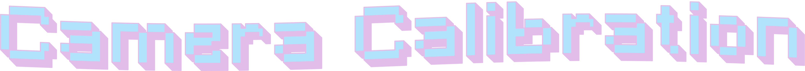

<a href="https://x.com/nearcyan/status/1706914605262684394">
  <picture>
    <source media="(prefers-color-scheme: dark)" srcset="assets/camera-calibration-dark.png">
    <source media="(prefers-color-scheme: light)" srcset="assets/camera-calibration-light.png">
    
  </picture>
</a>


**Welcome to the 1st lab session of Computer *Vision I* at Comillas ICAI**. Here, you will find all the necessary files to complete this session where you will learn how to calibrate cameras. 💻📷


## Resources

This laboratory session contains the following:

- 📄 **``CVI_lab_1.pdf``**: A ``PDF`` guide with instructions to complete the session.
- 💻 **``lab_1.ipynb``**: the code to complete.
- 🎞️ **``data``**: Arranged in three different subfolders: ``fisheye``, ``left`` and ``right``. They contain the images to process.
- 📝 **``template``**: A folder with a ``latex`` template used to generate the guide. You can reuse it to write your report.
- 🧩 **``assets``**: Files to style or improve documentation.
- 📖 **``README``**: You are reading it!

The lab session folder is structured as follows:

```bash
.
├── CVI_lab_1.pdf
├── src
│   └── lab_1.ipynb
├── data
│   ├── fisheye
│   ├── left
│   └── right
├── assets
├── template
└── README.md
```

## Get ready 🤓
If you're not enrolled and don't have access to the theory, or just want a refresher, check out the resources below before starting the lab.

- **Videos 1 to 4** in [Camera Calibration Playlist](https://www.youtube.com/playlist?list=PL2zRqk16wsdoCCLpou-dGo7QQNks1Ppzo)

- **Chapter 6** in [Concise Computer Vision: An Introduction into Theory and Algorithms](https://doc.lagout.org/science/0_Computer%20Science/2_Algorithms/Concise%20Computer%20Vision_%20An%20Introduction%20into%20Theory%20and%20Algorithms%20%5BKlette%202014-01-20%5D.pdf)

<h2 align="center" style="margin-bottom: 0px"; >Here we go: Lesson 1!</h2>
<p align="center">
  
</p>
<h3 align="center" style="margin-top: 0px;"> Be enthusiastic like Marge</h3>