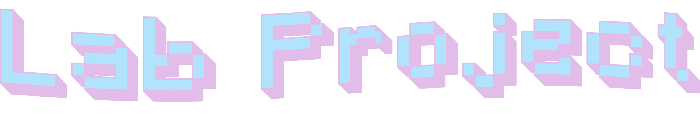

<a href="https://x.com/nearcyan/status/1706914605262684394">
  <picture>
    <source media="(prefers-color-scheme: dark)" srcset="assets/lab-project-dark.png">
    <source media="(prefers-color-scheme: light)" srcset="assets/lab-project-light.png">
    
  </picture>
</a>


**Welcome to the Lab Project of Computer *Vision I* at Comillas ICAI**. Here, you will find all the necessary files to start your project 💻📷


## Resources (WIP 🛠️)

This laboratory session contains the following:

- 📄 **Guide**: A ``PDF`` guide with instructions to complete the session (currently only available in Spanish).
- 💻 **Script**: a ``.ipynb`` or ``.py`` file to complete.
- 🎞️ **Data**: A folder containing images to process.
- 📝 **Template**: A folder with a ``latex`` template used to generate the guide. You can reuse it to write your report.
- 🧩 **Assets**: Files to style or improve documentation.
- 📖 **README**: With links to motivate the session or to introduce the theory concepts.

The folder lab session folder is structured as follows:

```bash
.
├── guide.pdf
├── src
│   ├── lab_session.ipynb
│   ├── lab_session.py
│   └── ...
├── data
│   ├── image1.png
│   ├── image2.png
│   └── ...
├── assets
├── template
└── README
```

## Get ready 🤓 (WIP 🛠️)
If you're not enrolled or don't have access to the theory, or just want a refresher, check out the resources below before starting the lab.


<h2 align="center" style="margin-bottom: 0px;">Here we go: Lab Project!</h2>
<p align="center">
  
</p>
<h3 align="center" style="margin-top: 0px;"> Hint: Don't be like Homer</h3>